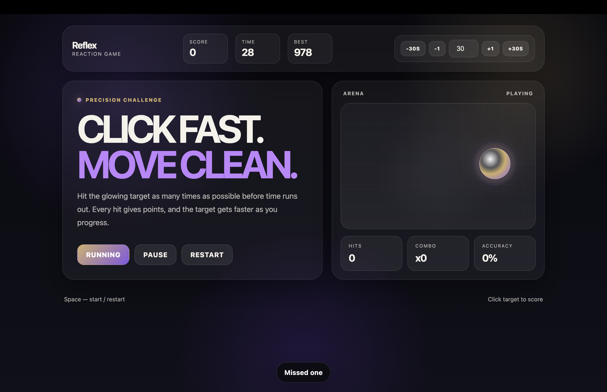
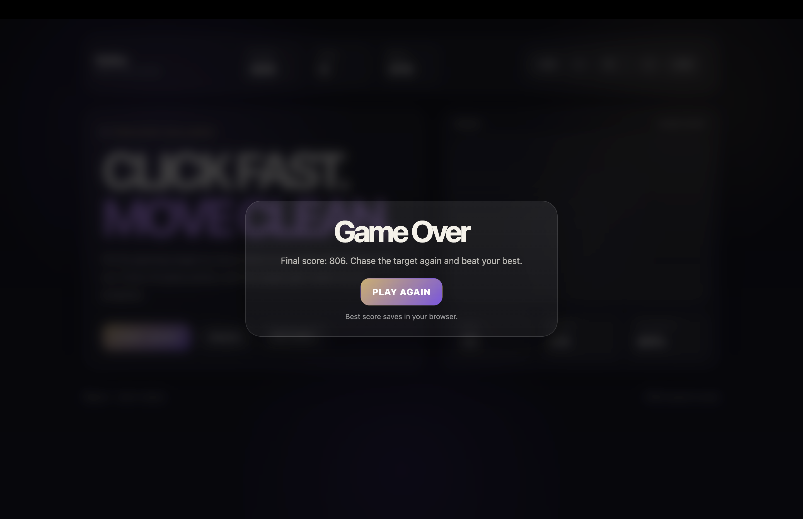

# Typing_game
# Reflex

A modern neon-style reaction game built with pure HTML, CSS and JavaScript.

Reflex is a fast-paced precision game where the player must click moving targets before time runs out. The game features a premium glassmorphism UI, combo system, accuracy tracker and customizable timer controls.

---

## Features

- Modern neon / glassmorphism design
- Responsive layout
- Dynamic moving targets
- Combo multiplier system
- Accuracy tracking
- High score saving with LocalStorage
- Adjustable game timer
- Pause / Resume support
- Keyboard shortcuts
- Animated effects and HUD

---

## Gameplay

The goal is simple:

- Click the glowing target as fast as possible
- Build combo multipliers
- Maintain high accuracy
- Beat your best score

The target becomes faster as your score increases.

---

## Controls

| Key / Button | Action |
|---|---|
| Space | Start / Pause |
| R | Restart Game |
| +1 | Add 1 second |
| +30s | Add 30 seconds |
| -1 | Remove 1 second |
| -30s | Remove 30 seconds |

---

## Scoring System

- Base hit gives points
- Combo increases score multiplier
- Missing targets resets combo
- Accuracy is calculated in real-time

---

## Technologies Used

- HTML5
- CSS3
- Vanilla JavaScript
- Flexbox
- CSS Grid
- LocalStorage API

---

## UI Features

- Neon gradients
- Animated glowing target
- Glassmorphism panels
- Responsive arena
- Toast notifications
- Animated overlays
- Smooth transitions

---

## Project Structure

```bash
Reflex/
│
├── index.html
├── style.css
├── script.js
└── README.md
```

## Run Locally

Clone the project:

```bash
git clone https://github.com/YOUR_USERNAME/reflex.git
```
Open index.html in browser.

Or use VSCode Live Server extension.

---

### Future Improvements
Difficulty selector
Leaderboard system
Sound effects
Mobile optimization
Power-ups
Different arena themes
Multiplayer mode

---
## About

Reflex was created as a modern browser reaction game focused on smooth visuals, responsive gameplay and clean UI design.

The project was built entirely without frameworks to improve JavaScript, UI/UX and frontend development skills.

---

## GitHub Repository

```bash
https://github.com/HackathonLeague/Typing_game
```

## Vercel Deployment Link
```bash
https://click-game-drab.vercel.app/
```




Author : Baimyrzaev Aruubek
Contact me : baymyrzaevaruubek10@gmail.com
